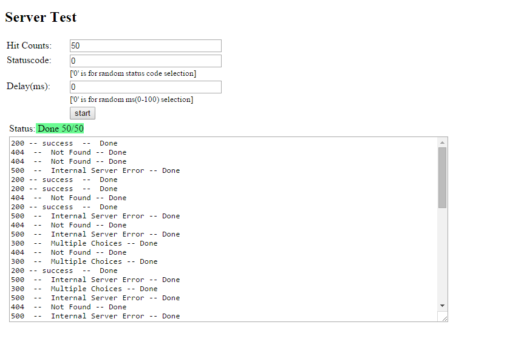
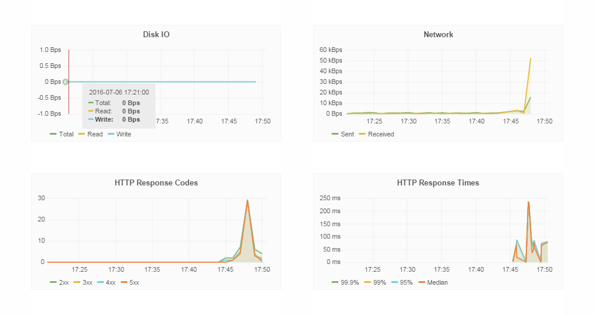

# Shipped Traefik Simulator

A simple Load Test application.

### Default: 

Hit Counts    : No of Hits requierd, Default value 50. Minimum value 1 and Maximum value 5000. 

StatusCode    : Expected Status Code in response (if left blank api will return random response code in the range of status code 2xx - 5xx)

Delay(ms)     : Amount of Delay response from to host, Minimum value can be 0 ms and Maximum value 5000 ms.

### Run Simulator

1. Fork the repo.

2. Create project in Shipped

3. Add existing repo to your shipped project.

4. Wait for build to complete.

5. Deploy you project to server.

6. App Started, Click on **save**. App hit random hits to the same host.

 

7. To verify the host usage, Go to **run** section and see the screen below.

 